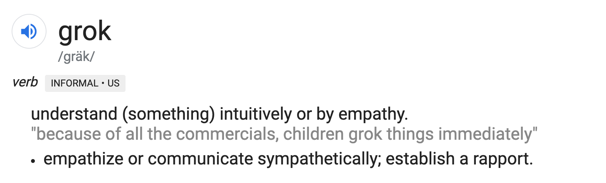
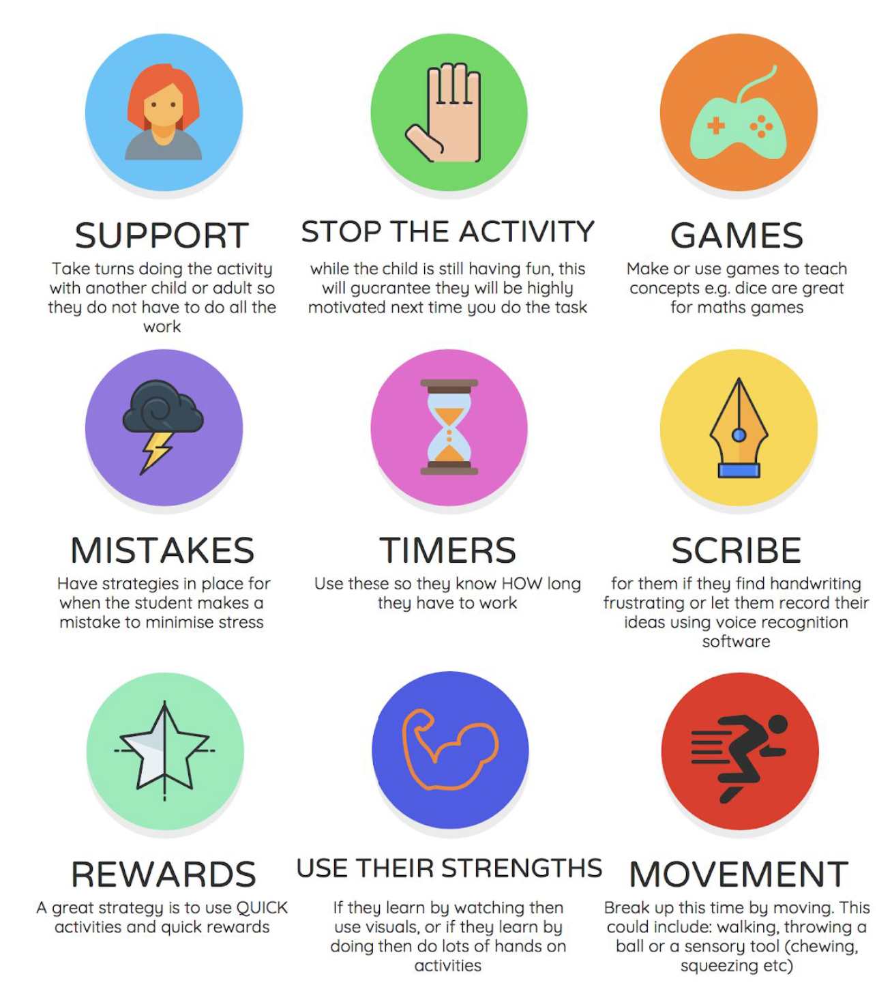
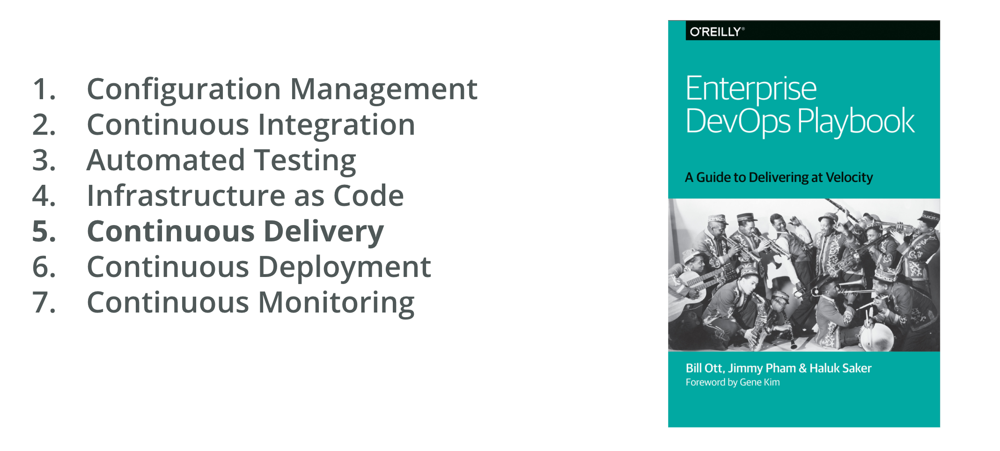
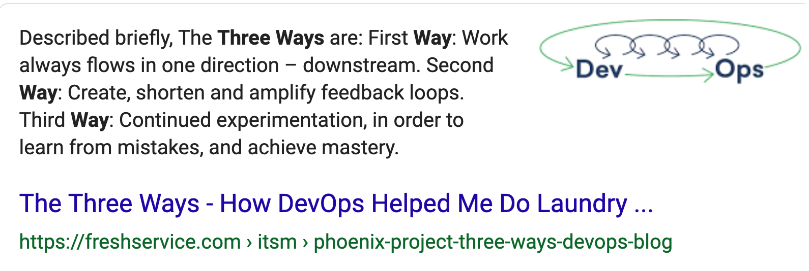

:title: Spinnaker & k8s
:author: Thomas A. McGonagle
:keywords: Spinnaker, k8s, SharkHack
:skip-help: true
:css: presentation.css

.. header::
    .. image:: images/Armory_logo.gif 
        :height: 300px
        :width: 600px
        :align: center

.. footer::
    .. image:: images/spinnaker.png 
        :height: 70px
        :width: 90px
        :align: center
    

----

:id: title-slide

Spinnaker & k8s
===============
SharkHack
---------
9/27/19 - 9/28/19
-----------------

.. note::

  * note

----

:id: agenda

Agenda
======

* whoami

* Administrvia

* Spinnaker and DevOps Overview

* CI/CD and Continuous Improvement

* Docker and k8s

* Restructured Text Overview

.. note::

  * note

----

:id: who-am-i

whoami?
=======
Thomas A. McGonagle
-------------------
Solutions Architect
-------------------
thomas.mcgonagle@armory.io
--------------------------
@mcgonagle
----------

.. note::
  * note

----

:id: intro

Introductions
===================

* Name

* Role

* Favorite Terrible Movie 

.. note::

  * note

----

:id: spinnaker-metaphor

Spinnaker Metaphor
========================

.. image:: images/waterworld.jpg 
    :height: 600px
    :width: 400px

.. note::
  * note

----

:id: workshop-goals

Workshop Goals
==============

* Grok Spinnaker

* ??

.. note::

  * note

----

:id: workshop-philosophy

Workshop Philosophy
===================

.. image:: images/grampy.png 
    :height: 175px
    :width: 250px
    :align: left

----

:id: learning-fun 

Fun Learning Strategies
=======================

.. note::
  * note

----

:id: devops-definition

DevOps Definition
=================

Technical and **Cultural** focus on **Teamwork** and the software delivery **Mission** 
--------------------------------------------------------------------------------------

.. note::

    * note

----

:id: devops-tenants

DevOps Tenants - ACAMS+
=======================

* Agile
* Culture
* Automation
* Metrics
* Sharing
* Plus...

.. note::

    * note

----

:id: devops-practices

DevOps Practices
=======================

.. note::

    * note

----

:id: hovercaft

hovercraft
==========

https://hovercraft.readthedocs.io/en/latest/index.html

.. note::

    * note

----

:id: continuous-improvement 

Continuous Improvement
======================

.. image:: https://www.planview.com/wp-content/uploads/2018/09/what-is-continuous-improvement-leankit.jpg
    :height: 600px
    :width: 1000px
    :align: center

.. note::

    * note

----

:id: three-ways

Three Ways
==========

.. note::

    * note

----

:id: dog-food

Dog Food
========

.. image:: https://images-na.ssl-images-amazon.com/images/I/81XPwF8NnAL._SL1500_.jpg
    :height: 600px
    :width: 800px
    :align: center

.. note::

    * note

----

:id: ci-cd

CI/CD
========

.. image:: https://www.talend.com/wp-content/uploads/DevOps-Talend-1.png
    :height: 600px
    :width: 1200px
    :align: center

.. note::

    * note

----

:id: docker

docker
======

Make a Change and then....

.. code:: python

    docker build --tag=mcgonagle/sharkhack . && docker run -it --rm -p "9000:9000" mcgonagle/sharkhack

.. note::

    * note

----

:id: k8s

k8s
===

.. code:: python

    docker build --tag=mcgonagle/sharhack .

    docker push mcgonagle/sharkhack:latest

    kubectl -n default run sharkhack --image=mcgonagle/sharkhack 

    kubectl -n default expose deployment/sharkhack --port=9000 --target-port=9000

    kubectl -n default port-forward services/sharkhack 9000:9000

.. note::

    * note

----

:id: headers

Headers
=======

.. code:: python
    
    This becomes a h1
    =================

    And this a h2
    -------------

.. note::

    * note

----

:id: bullets

bullets
=======

.. code:: python

    * Bullet 1

        * Bullet 1.1

    * Bullet 2

    * Bullet 3

.. note::

    * note

----

:id: lists

lists
=======

.. code:: python

    1. Item 1

        1.1. Item 1.1

    2. Item 2

    3. Item 3

.. note::

    * note

----

:id: images

images
======

.. code:: python

    .. image:: path/to/image.png
        :height: 600px
        :width: 800px

.. note::

    * note

----

:id: questions

Questions?
==========

Presentation available at: https://github.com/mcgonagle/sharkhack

.. note::

    * note
